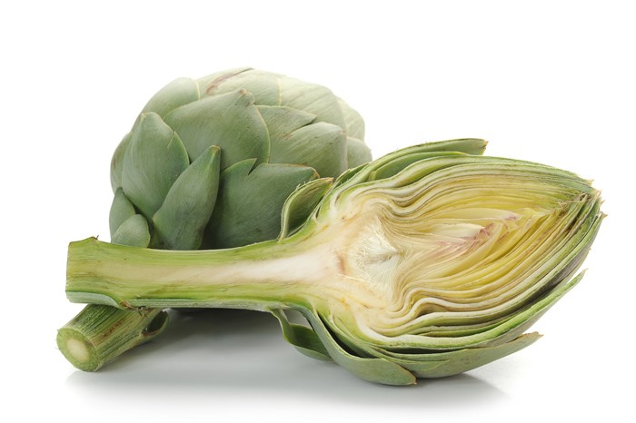
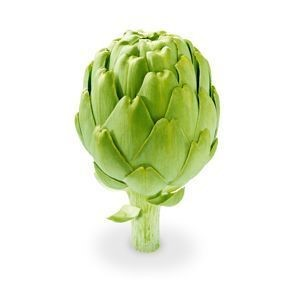

```{r packages-setup, include = FALSE}
library(tidyverse)
library(eurostat)
library(rio)
library(ggplot2)
library(plotly)
library(kableExtra)
library(gt)
library(wordcloud2)
library(gganimate)
library(ggthemes)
```

```{r chunk-setup, include = FALSE}
knitr::opts_chunk$set(echo = TRUE, eval = TRUE, message = FALSE, warning = FALSE, comment = FALSE,
                      #results = "hold",
                      cache = FALSE, cache.path = "/caches/", comment = "#>",
                      #fig.width = 15,  fig.height= 15,   
                      #out.width = 7, out.height = 7,
                      collapse = TRUE,  fig.show = "hold",
                      fig.asp = 7/9, out.width = "70%", fig.align = "center")
knitr::opts_chunk$set(dev = "png", dev.args = list(type = "cairo-png"))
```

```{r options-setup, include = FALSE}
options(scipen = 999) #- para quitar la notación científica
options("yaml.eval.expr" = TRUE) 
```


```{r klippy, echo = FALSE}
klippy::klippy(position = c("top", "right")) #- remotes::install_github("rlesur/klippy")
```

<hr class="linea-black">

Trabajo elaborado para la asignatura "Programación y manejo de datos en la era del Big Data" de la Universitat de València durante el curso 2020-2021. El repo del trabajo está [aquí](https://github.com/miguercios/trabajo_BigData){target="_blank"}. La página web de la asignatura y los trabajos de mis compañeros pueden verse [aquí](https://perezp44.github.io/intro-ds-20-21-web/07-trabajos.html){target="_blank"}.

<hr class="linea-red">

# I. Introducción {.tabset}
  
## ..
En este trabajo haremos un estudio sobre la **producción de alcachofas en Europa y España**.  
  
Explorando la base de datos de **Eurostat** di con unos datos completos y detallados de la producción agrícola en Europa, de modo que me decanté por ellos. La elección de este tema ha sido motivada por la disponibilidad de un dataset lo suficientemente detallado, además de que me gustan las alcachofas. 
  
Opté por centrarme en un solo producto, que han sido las alcachofas. Aunque los datos llegan hasta 2020 hay muchos paises que no tienen datos para ese año, por lo que he optado por considerar **2019** como el año más reciente. 

<!-- meter aquí alcachofa -->

```{r alcachofa, eval = TRUE, echo = FALSE}

```

## .

Sección añadida para asegurar la correcta ejecución del mismo gráfico más abajo.   

```{r, eval= TRUE, echo = FALSE }
#Este código está aquí porque si no no funciona más abajo. No le encuentro explicación

# Cargamos datos y geometrías
datos <- rio::import ('./datos/alcachofas.csv')

pr_esp <- datos %>% filter(strucpro_code == 'PR', geo_code == 'ES') %>% select(geo_code, geo, time, values) %>%
  group_by(geo_code) %>% arrange(time) %>% mutate(acum = cumsum(values)) %>% ungroup() %>%
  mutate (acum = as.numeric(acum)) %>% rename(prod = values, prsum = acum)

ar_esp <- datos %>% filter(strucpro_code == 'AR', geo_code == 'ES') %>% select(geo_code, geo, time, values) %>%
  group_by(geo_code) %>% arrange(time) %>% rename (area = values)

esp <- full_join(pr_esp, ar_esp)
esp <- esp %>% mutate (prodxha = prod/area)

p4 <- ggplot(esp, aes(x = time)) +
      geom_line(aes(y = prod), alpha = 0.7, size = 1.7, color = "red") +
      geom_line(aes(y = area), alpha = 0.7, size = 1.7, color = "yellow") +
      geom_line(aes(y = prodxha ), alpha = 0.7, size = 1.7, color = "green") +
     labs(x = "Año", 
       y = "Producción (miles de t) / Área (miles de Ha)",
       title= 'Producción de alcachofas y área utilizada en España', 
       subtitle = 'Datos de 1964 a 2019', 
       caption = '(C) EuroGeographics for the administrative boundaries') 

ggplotly(p4)

```

# II. Datos
  
El estudio se realiza con unos **datos de producción agrícola** de la base de datos **Eurostat**.
  
A continuación podemos ver el proceso de obtención y limpieza de los datos, que acaba con un archivo definivo a partir del cual se han elaborado los contenidos. 

## 1. Obtención y limpieza {.tabset}

El estudio se realiza con unos **datos de producción agrícola** de la base de datos **Eurostat**.
  
A continuación podemos ver el proceso de obtención y limpieza de los datos, que acaba con un archivo definivo a partir del cual se han elaborado los contenidos. 
  
### Exploración de datos

```{r, eval = FALSE}
# Función resumidora del profesor
zz <- pjpv2020.01::pjp_f_unique_values(df_5, truncate = TRUE, nn_truncate = 47) 


# Crop production in EU standard humidity (apro_cpsh1)	
df1 <- get_eurostat("apro_cpsh1", time_format = 'raw', keepFlags = T )
df_1 <- label_eurostat(df1) 

df1 <- label_eurostat(df1, code= c("crops", "strucpro", "geo") )
df1 <- df1 %>% filter (crops == 'Artichokes') %>%
  mutate(values = ifelse(is.na(values), 0, values))


rio::export(df, "./datos/Produccion_agri.xlsx")
rio::export(df_1, "./datos/Produccion_agri_lab.xlsx")

# Unit values at basic prices (aact_uv01)	
df2 <- get_eurostat("aact_uv01", time_format = 'raw', keepFlags = T)
df_2 <- label_eurostat(df2)

df2 <- label_eurostat(df2, code = c("itm_newa", "geo", "unit"))
df2 <- df2 %>% filter (itm_newa == 'ARTICHOKES') %>% filter (unit == 'Euro per tonne')


# Unit values quantities (en miles de t) (aact_uv03)	
df3 <- get_eurostat("aact_uv03", time_format = 'raw', keepFlags = T)
df_3 <- label_eurostat(df3)

df3 <- label_eurostat(df3, code = c("itm_newa", "geo"))
df3 <- df3 %>% filter (itm_newa == 'ARTICHOKES') %>%
  rename ( uds_prod_1000t = values)


# Dataframe conjunto df2 y df3
df4 <- full_join(df2, df3, by = c("geo_code", "time")) 
df4 <- df4 %>% select (geo_code, unit, geo.x, itm_newa.x, time, values, uds_prod_1000t)

```

### Limpieza de los datos definitivos

```{r, eval = FALSE}
# Función resumidora del profesor
zz <- pjpv2020.01::pjp_f_unique_values(df1, truncate = TRUE, nn_truncate = 47) 

# Crop production in EU standard humidity (1000 t) (apro_cpsh1)	
df1 <- get_eurostat("apro_cpsh1", time_format = 'raw', keepFlags = T )
df_1 <- label_eurostat(df1) 

dffull <- label_eurostat(df1, code= c("crops", "strucpro", "geo") )

df1 <- dffull %>% filter (crops == 'Artichokes') %>%
  mutate(values = ifelse(is.na(values), 0, values)) %>%
  select(strucpro_code, geo_code, crops, strucpro, geo, time, values)

# Crop production - historical data (1955-1999) (apro_cpnh1_h)	 
df2 <- get_eurostat("apro_cpnh1_h", time_format = 'raw', keepFlags = T )
df_2 <- label_eurostat(df2) 

dffull2 <- label_eurostat(df2, code= c("crops", "strucpro", "geo"))
df2 <- dffull2 %>% filter (crops == 'Artichokes') %>%
  mutate(values = ifelse(is.na(values), 0, values)) %>%
  select(strucpro_code, geo_code, crops, strucpro, geo, time, values)

# Juntamos los dataframes, asumiendo que la producción en estándar de humedad de la UE es el mismo que el histórico
dftodo <- full_join(dffull, dffull2)
dftodored <- full_join(df1, df2)

dfbueno <- dftodored

# Cambiamos algunos valores
dfbueno$strucpro_code[dfbueno$strucpro_code == "PR_HU_EU"] <- "PR"
dfbueno$strucpro[dfbueno$strucpro == "Harvested production in EU standard humidity (1000 t)"] <- "Harvested production (1000 t)"

rio::export(dfbueno, './datos/alcachofas.csv')
rio::export(dftodo, './datos/produccionext.csv')
rio::export(dftodored, './datos/produccion.csv')

rm(df_1, df_2, df1, df2, dffull, dffull2, dftodo, dftodored, dfbueno)

datos <- rio::import ('./datos/alcachofas.csv')

#- Descargamos geometrías de Europa
geometrias <- get_eurostat_geospatial(resolution = "20", nuts_level = "0")
plot(geometrias, max.plot = 1)

mapdata <- full_join(datos, geometrias, by = c("geo_code" = "id"))
```

## 2. Tabla de datos 
  
**AR** representa los valores para área cultivada en miles de hectáreas, y **PR** representa la producción en miles de toneladas.

```{r, eval = TRUE}
datos <- rio::import ('./datos/alcachofas.csv') %>% select(!c(strucpro, crops))
datos$geo[datos$geo_code == "DE"] <- "Germany"
datos$geo[datos$geo_code == "XK"] <- "Kosovo"

DT::datatable(datos)
```
  

# III. Estudios realizados
  
## 1. Área dedicada al cultivo de alcachofas {.tabset}
  
### Mapa de área cultivada
  
Como podemos observar en el siguiente mapa, los paises que dedican una mayor área al cultivo de alcachofas en Europa son **Italia y España**, con un área dedicada de entre 11 y 20, y de más de 20 miles de hectáreas respectivamente.  
  
Los siguientes paises que encontramos son **Francia, Turquía y Malta**, que dedican una área de entre 1000 y 10000 hectáreas al cultivo de alcachofas.   
El resto de paises o bien no cultivan, o bien dedican menos de mil hectáreas a producir alcachofas, por lo que consideramos su contribución como insignificante. 


```{r estudio1, eval= TRUE, echo= FALSE, warning= FALSE, comment = FALSE}
# Cargamos datos y geometrías
datos <- rio::import ('./datos/alcachofas.csv')
datos19 <- datos %>% filter(time == '2019', strucpro_code == 'AR')

geometrias <- get_eurostat_geospatial(resolution = "20", nuts_level = "0")
mapdata <- full_join(datos, geometrias, by = c("geo_code" = "id"))

ha_19 <- mapdata %>% filter (strucpro_code == 'AR', time == '2019')

#- Creamos grupos según los valores para que poder mostrarlos en el mapa. He tenido que convertirlos en enteros porque no conseguía que leyera los números con decimales
ha_19 <- ha_19 %>% mutate (values = as.integer(values)) %>%
  mutate(grupos  = case_when( 
  values %in% (-1:0) ~ "0-1",
  values %in% (0:10) ~ "1-10",
  values %in% (10:20) ~ "11-20",
  values %in% (21:100) ~ '20 o más'))
  
# Mapa area cultivada en 2019 
p <- ggplot(ha_19) +
     geom_sf(aes(fill= grupos, geometry = geometry), color = "black", size = .1) +
     scale_fill_brewer(palette = "RdYlBu")  +
     labs(title = "Área dedicada al cultivo de alcachofas en 2019",
       subtitle = "En miles de hectáreas",
       fill = "Miles de Ha",
       caption = "(C) EuroGeographics for the administrative boundaries") + theme_light() +
     coord_sf(xlim = c(-20,43), ylim = c(34,67))

p
```

### Código 

```{r codestudio1, eval= FALSE, echo= TRUE, warning= FALSE, comment = FALSE}
# Cargamos datos y geometrías
datos <- rio::import ('./datos/alcachofas.csv')
datos19 <- datos %>% filter(time == '2019', strucpro_code == 'AR')

geometrias <- get_eurostat_geospatial(resolution = "20", nuts_level = "0")
mapdata <- full_join(datos, geometrias, by = c("geo_code" = "id"))

ha_19 <- mapdata %>% filter (strucpro_code == 'AR', time == '2019')

#- Creamos grupos según los valores para que poder mostrarlos en el mapa. He tenido que convertirlos en enteros porque no conseguía que leyera los números con decimales
ha_19 <- ha_19 %>% mutate (values = as.integer(values)) %>%
  mutate(grupos  = case_when( 
  values %in% (-1:0) ~ "0-1",
  values %in% (0:10) ~ "1-10",
  values %in% (10:20) ~ "11-20",
  values %in% (21:100) ~ '20 o más'))
  
# Mapa area cultivada en 2019 
p <- ggplot(ha_19) +
     geom_sf(aes(fill= grupos, geometry = geometry), color = "black", size = .1) +
     scale_fill_brewer(palette = "RdYlBu")  +
     labs(title = "Área dedicada al cultivo de alcachofas en 2019",
       subtitle = "En miles de hectáreas",
       fill = "Miles de Ha",
       caption = "(C) EuroGeographics for the administrative boundaries") + 
     theme_light() + coord_sf(xlim = c(-20,43), ylim = c(34,67))

p
```
  
 
## 2. Producción de alcachofas en 2019 {.tabset}
  
### Mapa de producción
  
Este mapa nos muestra la producción de alcachofas en Europa en 2019.  
  
Rápidamente podemos ver que **España e Italia** son los principales producctores, seguidos por **Turquía, Francia y Grecia**, aunque estos en mucha menor medida.  
El resto de paises o bien no producen o su producción es insignificante a escala Europea. 
    
```{r estudio2 p1, eval= TRUE, echo= FALSE, warning= FALSE, comment = FALSE}
# Cargamos datos y geometrías
datos <- rio::import ('./datos/alcachofas.csv')
datos19 <- datos %>% filter(time == '2019', strucpro_code == 'PR') %>% mutate (values = as.integer(values))

geometrias <- get_eurostat_geospatial(resolution = "20", nuts_level = "0")

mapdata <- full_join(datos, geometrias, by = c("geo_code" = "id"))

pr_19 <- mapdata %>% filter (strucpro_code == 'PR', time == '2019')

#- Creamos grupos según los valores para que poder mostrarlos en el mapa. He tenido que convertirlos en enteros porque no conseguía que leyera los números con decimales
pr_19 <- pr_19 %>% mutate (values = as.integer(values)) %>%
  mutate(grupos  = case_when( 
  values %in% (0) ~ "0",
  values %in% (1:100) ~ "1-100",
  values %in% (101:200) ~ "101-200",
  values %in% (201:1000) ~ '200 o más'))
  
# Mapa area cultivada en 2019 
p <- ggplot(pr_19) +
     geom_sf(aes(fill= grupos, geometry = geometry), color = "black", size = .1) +
     scale_fill_brewer(palette = "BrBG")  +
     labs(title = "Producción de alcachofas en 2019",
       subtitle = "En miles de toneladas",
       fill = "Miles de t",
       caption = "(C) EuroGeographics for the administrative boundaries") + theme_light() +
     coord_sf(xlim = c(-20,43), ylim = c(34,67))

p
```

```{r estudio2 p2, eval= TRUE, echo= FALSE, warning= FALSE, comment = FALSE}
# Tabla mayores productores

italy <- './imagenes/it'
spain <- './imagenes/es'
turkey <- './imagenes/tr'
france <- './imagenes/fr'
greece <- './imagenes/gr'
banderas <- c(italy, spain, turkey, france, greece)


tabla19 <- datos19 %>% filter (values < 600) %>% select (geo, values)  %>% 
  slice_max (values, n = 5) %>% arrange ( desc(values)) %>% mutate(values= as.numeric(values)) %>%
  rename('País' = geo, 'Cantidad producida (miles de t)' = values)

tabla19$País[tabla19$País == "Italy"] <- "Italia"
tabla19$País[tabla19$País == "Spain"] <- "España"
tabla19$País[tabla19$País == "Turkey"] <- "Turquía"
tabla19$País[tabla19$País == "France"] <- "Francia"
tabla19$País[tabla19$País == "Greece"] <- "Grecia"

# No he podido hacer funcionar las banderas
# add_column(banderas, .before = 'geo') %>% 
  
tabla19 %>% gt() %>%
  tab_header(title = md("**Producción de alcachofas en Europa**"),  
            subtitle = md("Cantidades producidas en 2019"))%>%
  tab_source_note(md("(C) EuroGeographics for the administrative boundaries")) %>% 
  tab_options(heading.background.color = "darkred", column_labels.font.weight = "bold")
```


### Código

```{r codestudio2 p1, eval= FALSE, echo= TRUE, warning= FALSE, comment = FALSE}
# Cargamos datos y geometrías
datos <- rio::import ('./datos/alcachofas.csv')
datos19 <- datos %>% filter(time == '2019', strucpro_code == 'PR') %>% mutate (values = as.integer(values))

geometrias <- get_eurostat_geospatial(resolution = "20", nuts_level = "0")

mapdata <- full_join(datos, geometrias, by = c("geo_code" = "id"))

pr_19 <- mapdata %>% filter (strucpro_code == 'PR', time == '2019')

#- Creamos grupos según los valores para que poder mostrarlos en el mapa. He tenido que convertirlos en enteros porque no conseguía que leyera los números con decimales
pr_19 <- pr_19 %>% mutate (values = as.integer(values)) %>%
  mutate(grupos  = case_when( 
  values %in% (0) ~ "0",
  values %in% (1:100) ~ "1-100",
  values %in% (101:200) ~ "101-200",
  values %in% (201:1000) ~ '200 o más'))
  
# Mapa area cultivada en 2019 
p <- ggplot(pr_19) +
     geom_sf(aes(fill= grupos, geometry = geometry), color = "black", size = .1) +
     scale_fill_brewer(palette = "BrBG")  +
     labs(title = "Producción de alcachofas en 2019",
       subtitle = "En miles de toneladas",
       fill = "Miles de t",
       caption = "(C) EuroGeographics for the administrative boundaries") + theme_light() +
     coord_sf(xlim = c(-20,43), ylim = c(34,67))

p
```

```{r codestudio2 p3, eval= FALSE, echo= TRUE, warning= FALSE, comment = FALSE}
# Tabla mayores productores

italy <- './imagenes/it'
spain <- './imagenes/es'
turkey <- './imagenes/tr'
france <- './imagenes/fr'
greece <- './imagenes/gr'
banderas <- c(italy, spain, turkey, france, greece)


tabla19 <- datos19 %>% filter (values < 600) %>% select (geo, values)  %>% 
  slice_max (values, n = 5) %>% arrange ( desc(values)) %>% mutate(values= as.numeric(values)) %>%
  rename('País' = geo, 'Cantidad producida (miles de t)' = values)

tabla19$País[tabla19$País == "Italy"] <- "Italia"
tabla19$País[tabla19$País == "Spain"] <- "España"
tabla19$País[tabla19$País == "Turkey"] <- "Turquía"
tabla19$País[tabla19$País == "France"] <- "Francia"
tabla19$País[tabla19$País == "Greece"] <- "Grecia"

# No he podido hacer funcionar las banderas
# add_column(banderas, .before = 'geo') %>% 

tabla19 %>% gt() %>%
  tab_header(title = md("**Producción de alcachofas en Europa**"),  
            subtitle = md("Cantidades producidas en 2019"))%>%
  tab_source_note(md("(C) EuroGeographics for the administrative boundaries")) %>% 
  tab_options(heading.background.color = "darkred", column_labels.font.weight = "bold")

```
  
  
## 3. Producción histórica acumulada {.tabset}
  
### Wordcloud
  
Este Wordcloud nos da una primera impresión rápida de la escala de los **números de producción histórica**.  
Como podemos ver **España e Italia** son prácticamente los únicos productores, seguidos de **Francia** con una producción mucho menor.  
  
```{r estudio3 p1, eval= TRUE, echo= FALSE, warning= FALSE, comment = FALSE}
# Cargamos datos y geometrías
datos <- rio::import ('./datos/alcachofas.csv')
datoscum <- datos %>% filter(strucpro_code == 'PR') %>% select(geo_code, geo, time, values) %>%
  group_by(geo_code) %>% arrange(time) %>% mutate(acum = cumsum(values)) %>% ungroup() %>%
  mutate (acum = as.numeric(acum))

# wordcloud
datosfin <- datoscum %>% filter (time == "2019") %>% select (geo, acum)
datosfin$geo[datosfin$geo == "Italy"] <- "Italia"
datosfin$geo[datosfin$geo == "Spain"] <- "España"
datosfin$geo[datosfin$geo == "Turkey"] <- "Turquía"
datosfin$geo[datosfin$geo == "France"] <- "Francia"
datosfin$geo[datosfin$geo == "Greece"] <- "Grecia"

wordcloud2(datosfin, size = 1)

```
  
### Mapa de producción acumulada
  
En esta sección hay que tener en cuenta que algunos países, como Turquía que tenía más producción en la sección anterior, no tienen datos que lleguen hasta 1964.  
Sin embargo, la gran escala de producción de **Italia y España** no deja lugar a dudas de que son los mayores productores de alcachofas de Europa, tanto **históricamente como en la actualidad**.  
    
```{r estudio3 p2, eval= TRUE, echo= FALSE, warning= FALSE, comment = FALSE}
# mapa

geometrias <- get_eurostat_geospatial(resolution = "20", nuts_level = "0")
mapdata <- full_join(datoscum, geometrias, by = c("geo_code" = "id"))

pr_acum <- mapdata %>% filter (time == '2019') %>% filter (geo_code != 'EU', geo_code != 'EU27_2020', geo_code != 'EU28') %>%
  mutate(acum= as.numeric(acum))

pr_acum <- pr_acum %>% mutate (acum = as.integer(acum)) %>%
  mutate(grupos  = case_when( 
  acum %in% (0) ~ "0",
  acum %in% (1:100) ~ "1 a 100",
  acum %in% (101:1000) ~ "100 a 1000",
  acum %in% (1001:10000) ~ '1000 a 10000',
  acum %in% (10001:100000) ~ '10000 o más'  ))

p <- ggplot(pr_acum) +
     geom_sf(aes(fill= grupos, geometry = geometry), color = "black", size = .1) +
     scale_fill_brewer(palette = "PuOr")  +
     labs(title = "Producción de alcachofas histórica acumulada",
       subtitle = "Datos desde 1964 hasta 2019",
       fill = "Miles de t",
       caption = "(C) EuroGeographics for the administrative boundaries") + theme_light() +
     coord_sf(xlim = c(-20,43), ylim = c(34,67))
p

```

```{r estudio3 p3, eval= TRUE, echo= FALSE, warning= FALSE, comment = FALSE}
# Tabla mayores productores acumulado

tabla_acum <- datoscum %>% filter (geo_code != 'EU', geo_code != 'EU27_2020', geo_code != 'EU28', time == '2019') %>% 
  select (geo, acum)  %>% 
  slice_max (acum, n = 5) %>% arrange ( desc(acum)) %>% 
  rename('País' = geo, 'Cantidad producida (miles de t)' = acum)

tabla_acum$País[tabla_acum$País == "Italy"] <- "Italia"
tabla_acum$País[tabla_acum$País == "Spain"] <- "España"
tabla_acum$País[tabla_acum$País == "Turkey"] <- "Turquía"
tabla_acum$País[tabla_acum$País == "France"] <- "Francia"
tabla_acum$País[tabla_acum$País == "Greece"] <- "Grecia"

  
tabla_acum %>% gt() %>%
  tab_header(title = md("**Producción acumulada de alcachofas en Europa**"),  
            subtitle = md("Cantidades producidas entre 1964 y 2019"))%>%
  tab_source_note(md("(C) EuroGeographics for the administrative boundaries")) %>% 
  tab_options(heading.background.color = "darkred", column_labels.font.weight = "bold")
```

### Código

```{r codestudio3 p1, eval= FALSE, echo= TRUE, warning= FALSE, comment = FALSE}
# Cargamos datos y geometrías
datos <- rio::import ('./datos/alcachofas.csv')
datoscum <- datos %>% filter(strucpro_code == 'PR') %>% select(geo_code, geo, time, values) %>%
  group_by(geo_code) %>% arrange(time) %>% mutate(acum = cumsum(values)) %>% ungroup() %>%
  mutate (acum = as.numeric(acum))


# wordcloud
datosfin <- datoscum %>% filter (time == "2019") %>% select (geo, acum)

wordcloud2(datosfin)

# mapa

geometrias <- get_eurostat_geospatial(resolution = "20", nuts_level = "0")
mapdata <- full_join(datoscum, geometrias, by = c("geo_code" = "id"))

pr_acum <- mapdata %>% filter (time == '2019') %>% filter (geo_code != 'EU', geo_code != 'EU27_2020', geo_code != 'EU28') %>%
  mutate(acum= as.numeric(acum))

pr_acum <- pr_acum %>% mutate (acum = as.integer(acum)) %>%
  mutate(grupos  = case_when( 
  acum %in% (0) ~ "0",
  acum %in% (1:100) ~ "1 a 100",
  acum %in% (101:1000) ~ "100 a 1000",
  acum %in% (1001:10000) ~ '1000 a 10000',
  acum %in% (10001:100000) ~ '10000 o más'  ))

p <- ggplot(pr_acum) +
     geom_sf(aes(fill= grupos, geometry = geometry), color = "black", size = .1) +
     scale_fill_brewer(palette = "PuOr")  +
     labs(title = "Producción de alcachofas histórica acumulada",
       subtitle = "Datos desde 1964 hasta 2019",
       fill = "Miles de t",
       caption = "(C) EuroGeographics for the administrative boundaries") + theme_light() +
     coord_sf(xlim = c(-20,43), ylim = c(34,67))
p
```

```{r codestudio3 p2, eval= FALSE, echo= TRUE, warning= FALSE, comment = FALSE}
# Tabla mayores productores acumulado

tabla_acum <- datoscum %>% filter (geo_code != 'EU', geo_code != 'EU27_2020', geo_code != 'EU28', time == '2019') %>% 
  select (geo, acum)  %>% 
  slice_max (acum, n = 5) %>% arrange ( desc(acum)) %>% 
  rename('País' = geo, 'Cantidad producida (miles de t)' = acum)

tabla_acum$País[tabla_acum$País == "Italy"] <- "Italia"
tabla_acum$País[tabla_acum$País == "Spain"] <- "España"
tabla_acum$País[tabla_acum$País == "Turkey"] <- "Turquía"
tabla_acum$País[tabla_acum$País == "France"] <- "Francia"
tabla_acum$País[tabla_acum$País == "Greece"] <- "Grecia"

  
tabla_acum %>% gt() %>%
  tab_header(title = md("**Producción acumulada de alcachofas en Europa**"),  
            subtitle = md("Cantidades producidas entre 1964 y 2019"))%>%
  tab_source_note(md("(C) EuroGeographics for the administrative boundaries")) %>% 
  tab_options(heading.background.color = "darkred", column_labels.font.weight = "bold")
```
  

## 4. Producción en España {.tabset}

```{r, echo = FALSE}
# Cargamos datos y geometrías
datos <- rio::import ('./datos/alcachofas.csv')

pr_esp <- datos %>% filter(strucpro_code == 'PR', geo_code == 'ES') %>% select(geo_code, geo, time, values) %>%
  group_by(geo_code) %>% arrange(time) %>% mutate(acum = cumsum(values)) %>% ungroup() %>%
  mutate (acum = as.numeric(acum)) %>% rename(prod = values, prsum = acum)

ar_esp <- datos %>% filter(strucpro_code == 'AR', geo_code == 'ES') %>% select(geo_code, geo, time, values) %>%
  group_by(geo_code) %>% arrange(time) %>% rename (area = values)

esp <- full_join(pr_esp, ar_esp)
esp <- esp %>% mutate (prodxha = prod/area)
```

### Área
  
Como podemos ver representada por la linea amarilla, el área utilizada en España para el cultivo de alachofas fue subiendo hasta 1990, donde alcanzó un pico de aproximandamente **32.000 hectáreas**.
  
Actualmente el área utilizada ronda las **15.000 hectáreas**.
  
La linea verde representa la **producción de alcachofas por hectárea**, siendo la producción en **toneladas de alcachofas**. Esta linea también la podemos encontrar en el siguiente gráfico.   

```{r, echo = FALSE}
#- Gráfico área
p1 <- ggplot(esp) +
      geom_line(aes(x = time, y = area), alpha = 0.7, size = 1.7, color = "yellow") +
      geom_line(aes(x = time, y = prodxha), alpha = 0.7, size = 1.7, color = "green") +
      scale_color_viridis_d() +
     labs(x = "Año", 
       y = "Área utilizada (miles de Ha)",
       title= 'Área dedicacada al cultivo de alcachofas en {frame_along}', 
       subtitle = 'Datos de 1964 a 2019', 
       caption = '(C) EuroGeographics for the administrative boundaries') + 
     transition_reveal(time)

p1

```


### Producción
  
En concordancia con el área utilizada, la producción de alcachofas en España también alcanzo un pico en los años 90, produciendo **440.000 toneladas de alcachofas**.   
Los datos más recientes (2019) muestran una producción de **199.000 toneladas de alcachofas**, menos de la mitad que las producidas en el pico de producción, pero todavía siendo una cantidad muy respetable, solo superada por Italia.  
  
La linea verde representa la **producción de alcachofas por hectárea**, siendo la producción en **toneladas de alcachofas**.
    
```{r, echo = FALSE}
#- Gráfico producción anual
p2 <- ggplot(esp) +
      geom_line(aes(x = time, y = prod), alpha = 0.7, size = 1.7, color = "red") +
      geom_line(aes(x = time, y = prodxha), alpha = 0.7, size = 1.7, color = "green") +
      scale_color_viridis_d() +
     labs(x = "Año", 
       y = "Producción (miles de t)",
       title= 'Producción de alcachofas en España en {frame_along}', 
       subtitle = 'Datos de 1964 a 2019', 
       caption = '(C) EuroGeographics for the administrative boundaries') + 
     transition_reveal(time)
p2 
```

### Producción acumulada
  
La producción histórica acumulada ha ido en un ascenso continuo hasta hoy.  
Con los datos más recientes podemos ver que España ha producido **14.233.000 toneladas de alcachofas** desde 1964, una cifra bastante impresionante y solo superada por Italia. 
  
```{r, echo = FALSE}
#- Gráfico producción acumulada
p3 <- ggplot(esp) +
      geom_line(aes(x = time, y = prsum), alpha = 0.7, size = 1.7, color = "blue") +
      scale_color_viridis_d() +
     labs(x = "Año", 
       y = "Producción (miles de t)",
       title= 'Producción acumulada en España en {frame_along}', 
       subtitle = 'Datos de 1964 a 2019', 
       caption = '(C) EuroGeographics for the administrative boundaries') + 
      transition_reveal(time)

p3
```


### Código

```{r, eval= FALSE, echo = TRUE}
# Cargamos datos y geometrías
datos <- rio::import ('./datos/alcachofas.csv')

pr_esp <- datos %>% filter(strucpro_code == 'PR', geo_code == 'ES') %>% select(geo_code, geo, time, values) %>%
  group_by(geo_code) %>% arrange(time) %>% mutate(acum = cumsum(values)) %>% ungroup() %>%
  mutate (acum = as.numeric(acum)) %>% rename(prod = values, prsum = acum)

ar_esp <- datos %>% filter(strucpro_code == 'AR', geo_code == 'ES') %>% select(geo_code, geo, time, values) %>%
  group_by(geo_code) %>% arrange(time) %>% rename (area = values)

esp <- full_join(pr_esp, ar_esp)
esp <- esp %>% mutate (prodxha = prod/area)


#- Gráfico área
p1 <- ggplot(esp) +
      geom_line(aes(x = time, y = area), alpha = 0.7, size = 1.7, color = "yellow") +
      geom_line(aes(x = time, y = prodxha), alpha = 0.7, size = 1.7, color = "green") +
      scale_color_viridis_d() +
     labs(x = "Año", 
       y = "Área utilizada (miles de Ha)",
       title= 'Área dedicacada al cultivo de alcachofas en {frame_along}', 
       subtitle = 'Datos de 1964 a 2019', 
       caption = '(C) EuroGeographics for the administrative boundaries') + 
     transition_reveal(time)

p1

#- Gráfico producción anual
p2 <- ggplot(esp) +
      geom_line(aes(x = time, y = prod), alpha = 0.7, size = 1.7, color = "red") +
      scale_color_viridis_d() +
     labs(x = "Año", 
       y = "Producción (miles de t)",
       title= 'Producción de alcachofas en España en {frame_along}', 
       subtitle = 'Datos de 1964 a 2019', 
       caption = '(C) EuroGeographics for the administrative boundaries') + 
     transition_reveal(time)
p2 


#- Gráfico producción acumulada
p3 <- ggplot(esp) +
      geom_line(aes(x = time, y = prsum), alpha = 0.7, size = 1.7, color = "blue") +
      scale_color_viridis_d() +
     labs(x = "Año", 
       y = "Producción (miles de t)",
       title= 'Producción acumulada en España en {frame_along}', 
       subtitle = 'Datos de 1964 a 2019', 
       caption = '(C) EuroGeographics for the administrative boundaries') + 
      transition_reveal(time)

p3


# Gráfico interactivo todo -> Este gráfico se muestra en la siguiente sección 

p4 <- ggplot(esp, aes(x = time)) +
      geom_line(aes(y = prod), alpha = 0.7, size = 1.7, color = "red") +
      geom_line(aes(y = area), alpha = 0.7, size = 1.7, color = "yellow") +
      geom_line(aes(y = prodxha ), alpha = 0.7, size = 1.7, color = "green") +
     labs(x = "Año", 
       y = "Producción (miles de t) / Área (miles de Ha)",
       title= 'Producción de alcachofas y área utilizada en España', 
       subtitle = 'Datos de 1964 a 2019', 
       caption = '(C) EuroGeographics for the administrative boundaries') 

ggplotly(p4)
```


## 5. Gráfico resumen datos de España
  
En este **gráfico interactivo** podemos ver un resumen de los datos de España, pudiendo ver el detalle de producción, área dedicada a la producción y producción por hectárea.   
  
La <FONT COLOR="red">**línea roja**</FONT> representa la **Producción de alchofas** a lo largo de los años, en miles de toneladas.  
  
La <FONT COLOR="yellow">**línea amarilla**</FONT> representa el **Área dedicada al cultivo de alcachofas**, en miles de hectáreas. 
  
La <FONT COLOR="green">**línea verde**</FONT> representa la **Producción por hectárea**, en toneladas por hectárea.  

Podemos desplazarnos por las lineas para ver la información detallada de cada año.
  
```{r, eval= TRUE, echo = FALSE }
# Cargamos datos y geometrías
datos <- rio::import ('./datos/alcachofas.csv')

pr_esp <- datos %>% filter(strucpro_code == 'PR', geo_code == 'ES') %>% select(geo_code, geo, time, values) %>%
  group_by(geo_code) %>% arrange(time) %>% mutate(acum = cumsum(values)) %>% ungroup() %>%
  mutate (acum = as.numeric(acum)) %>% rename(prod = values, prsum = acum)

ar_esp <- datos %>% filter(strucpro_code == 'AR', geo_code == 'ES') %>% select(geo_code, geo, time, values) %>%
  group_by(geo_code) %>% arrange(time) %>% rename (area = values)

esp <- full_join(pr_esp, ar_esp)
esp <- esp %>% mutate (prodxha = prod/area)

p4 <- ggplot(esp, aes(x = time)) +
      geom_line(aes(y = prod), alpha = 0.7, size = 1.7, color = "red") +
      geom_line(aes(y = area), alpha = 0.7, size = 1.7, color = "yellow") +
      geom_line(aes(y = prodxha ), alpha = 0.7, size = 1.7, color = "green") +
     labs(x = "Año", 
       y = "Producción (miles de t) / Área (miles de Ha)",
       title= 'Producción de alcachofas y área utilizada en España', 
       subtitle = 'Datos de 1964 a 2019', 
       caption = '(C) EuroGeographics for the administrative boundaries') 

ggplotly(p4)

```

# IV. Conclusiones
  
A partir de los datos podemos concluir rapidamente que **España** es uno de los mayores productores de alcachofas de Europa, superado solo por **Italia**.

Es razonable asumir que **Italia y España** son los principales suministradores de alcachofas al resto de paises de Europa, sobretodo a los países del espacio Schengen de libre mercado. 

```{r alcachofa2, eval = TRUE, echo = FALSE}

```

  
# V. Bibliografía
  
  - Datos de Eurostat: <https://ec.europa.eu/eurostat/web/agriculture/data/database>
  - Página Web del profesor Pedro Pérez: <https://perezp44.github.io/intro-ds-20-21-web/> 
  - Consultas en Stack overflow: <https://stackoverflow.com/questions/5824173/replace-a-value-in-a-data-frame-based-on-a-conditional-if-statement>
  
  
  